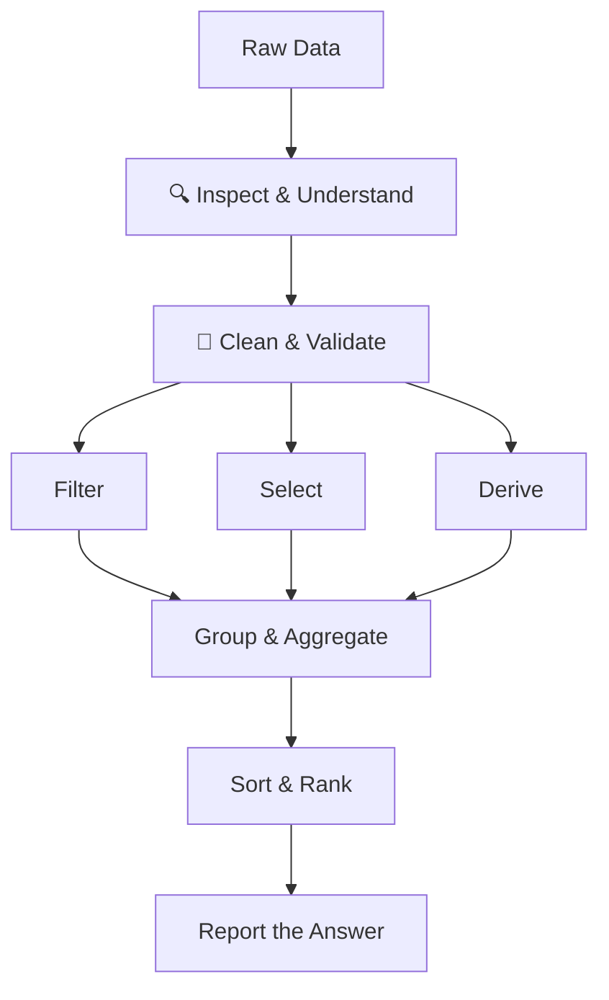

> Data analysis isn't about knowing every Pandas method — it's about knowing which question you're answering.
> This playbook covers how I go from raw, messy data to numbers I'd actually defend in a meeting,
> and what practicing on sales, campaign, and support datasets taught me along the way.

---

## Why It Matters

<!--
- What problem existed before this technology/approach existed?
- Which roles or industries would be lost without this knowledge?
- What made me pick this course over others on the same topic?
-->

My interest in data analysis didn't start with data analysis. It started with machine learning.

I wanted to build ML models, and every course, tutorial, and example assumed I already knew Pandas. So I started learning it as a prerequisite — a box to tick before getting to the "real" work. At first, I thought it would be a separate skill to learn on top of ML. What I found instead was that data analysis is a big part of the real work. Before a model sees a row of data, that data needs to be inspected, cleaned, filtered, reshaped, and summarised — and Pandas is the tool I use to do it.

- You can't build a reliable ML model on data you don't understand — and Pandas is how I started learning to understand it
- I learn best by working through a problem, not just reading about it. The questions and sample data are AI-generated from real-world-style scenarios, which forced me to reason through each problem instead of copying a pattern
- What started as "get through this so I can do ML" became an appreciation for how much value comes from the analysis stage before a model is trained

---

## Mental Model

<!--
- If I had to explain this to a 10-year-old, what analogy would I use?
- What is the single input → process → output flow of this topic?
- What does this remind me of that I already know well?
- What breaks when you misunderstand this topic?
-->

_A spreadsheet shows you data. Analysis makes the data answer a question. That distinction is the difference between a table and an insight._

Raw data (CSV, export, log)
→ Inspect shape and types
→ Clean (missing values, bad types, duplicates)
→ Filter / select the relevant slice
→ Derive new fields (bands, ratios, flags)
→ Group and aggregate
→ Sort and rank
→ Report the number that answers the original question



The tools provide the mechanics. The question you're answering provides the direction. Skip the question and you get a technically correct table that answers nothing.

### Key Principles

<!--
- What are the 3 rules this entire topic is built on?
- What would a practitioner never do, and why?
- What assumption does this topic challenge that most people hold?
-->
- **Start with the question, not the dataset** — Every exercise that went well started with "what decision does this number support?" Every exercise that went sideways started with "let me see what's in this file."
- **Data types are not automatic** — CSVs load everything as best-guess types. Dates come in as strings, numbers come in as objects if a single row has a stray character. Checking `.dtypes` before doing anything else is not optional.
- **Missing data is a decision, not an error** — Dropping, filling with median, filling with mode, or flagging as "unknown" are all valid choices — but they're different choices with different consequences. Pick one deliberately.
- **`loc` and `iloc` are not interchangeable** — `loc` is label-based, `iloc` is position-based. Confusing them silently returns the wrong rows instead of throwing an error, which is worse.
- **Aggregation without validation is still an assumption** — A `groupby().mean()` can look reasonable even when the input rows, types, or filters are wrong. Check row counts and totals before trusting it.

---

## Core Concepts

<!--
- What is the minimum vocabulary someone needs to have a useful conversation about this?
- Which concept took me the longest to actually understand — and why?
- Which concepts are commonly confused with each other?
-->

| Concept | Summary |
|---|---|
| DataFrame | A 2D labeled table — rows and columns, like a SQL table or Excel sheet — that's the core structure for almost all analysis work. |
| `loc` vs `iloc` | `loc` selects by label/condition, `iloc` selects by integer position. Mixing them up is one of the most common and hardest-to-notice bugs. |
| Missing Value Handling | Techniques (`fillna`, `dropna`, median/mode imputation) for dealing with incomplete data before it distorts aggregates. |
| Derived Field | A new column computed from existing ones — a ratio, a band, a flag — that makes a pattern visible instead of implicit. |
| GroupBy | Splitting data into categories, applying an aggregation (mean, sum, count) per group, and combining results back into a summary table. |
| KPI | A business metric (ROI, conversion rate, cost per conversion, average handle time) computed from aggregated raw data to support a decision. |
| Ranking / Top-N | Sorting aggregated results to answer "who/what performed best or worst" — usually the actual point of the analysis. |
| Data Validation | Cross-checking an aggregate against row counts, totals, or a second calculation method to catch silent errors. |

---

## Frameworks / Components

<!--
- Is there a named methodology or model the course is built around?
- What are the distinct stages, layers, or building blocks?
- How does each component fail if the others are missing?
-->

The framework that stuck with me is treating analysis as a pipeline, not a one-off script. Each stage has one job, and skipping a stage doesn't save time — it just moves the bug to a later, harder-to-find stage.

| Item | Purpose |
|---|---|
| **Inspect** | Check shape, dtypes, and a sample of rows before writing any logic. Without this, cleaning steps target the wrong problem. |
| **Clean** | Handle missing values, fix types (e.g. `pd.to_numeric`, `pd.to_datetime`), and remove duplicates. Without this, every downstream aggregate is unreliable. |
| **Filter / Select** | Narrow to the relevant rows and columns using `loc`/`iloc` or boolean masks. Without this, aggregates mix in data that shouldn't be there. |
| **Derive** | Create new columns — combined fields, bands, flags — that make the analysis question answerable directly. Without this, insights stay buried in raw values. |
| **Group & Aggregate** | Use `groupby` to roll rows up into category-level summaries. Without this, you're looking at transactions, not trends. |
| **Sort & Rank** | Order aggregated results to surface the top or bottom performers. Without this, the summary exists but the answer doesn't stand out. |
| **Validate** | Sanity-check the final numbers against totals or an alternate calculation. Without this, a plausible-looking wrong answer ships as fact. |

---

## Real-World Applications

<!--
- Where have I already seen this used — even before I knew the name for it?
- What would a PM, an engineer, and a business leader each do differently with this knowledge?
- What would a case study of this going wrong look like?
-->

- **Sales performance summaries** — Aggregating transaction-level sales data by manager and region to rank top performers and spot underperforming segments, moving from raw line items to a distinct, defensible leaderboard.
- **Electronics sales analysis** — Cleaning transactional data, deriving price bands and conditional flags, then grouping by category and time period to explain revenue swings, not just report them.
- **Marketing campaign KPIs** — Turning raw spend and click data into ROI, CTR, conversion rate, and cost-per-conversion — the metrics that actually justify (or kill) a campaign, rather than raw totals that look impressive but mean little on their own.
- **Support ticket operations** — Using conditional aggregation and mode calculations to surface satisfaction scores and common issue types, turning a ticket log into an operational health check.

---

## Code in Practice

<!--
- Which exercises best show the pipeline from Frameworks / Components in action?
- What's the one line in each sample that trips people up or teaches the most?
-->

A few samples from my practice repo, walked through stage by stage.

**[electronics_sales_analysis.py](https://github.com/ejsumi/CodeSamples/blob/main/DataAnalysis/electronics_sales_analysis.py)** ([question](https://github.com/ejsumi/CodeSamples/blob/main/DataAnalysis/electronics_sales_analysis_doc.md)) — clean → derive → filter → group, in one file.

```python
df['NetUnitPrice'] = df['UnitPrice'] * (1 - (df['DiscountPercent'] / 100))
df['ComputedTotal'] = df['Quantity']*df['NetUnitPrice']

conditions = [(df['ComputedTotal']>=1500.00),(df['ComputedTotal'].between(500,1500)),(df['ComputedTotal']<500.00)]
values = ['High Value','Medium Value','Low Value']
df['ValueBand'] = np.select(conditions, values, default='Unknown')
```
`np.select` makes the derive step concrete. Instead of trying to chain `if`/`elif` logic across a Series, I map a list of conditions directly to a list of labels, with `default` covering anything that falls through. The value band becomes something I can group and count, rather than a number I need to interpret every time. I calculate the derived fields before filtering to `Year == 2023` and the target regions, so the same calculation is applied consistently before the analysis narrows to its final slice.

**[sales_manager.py](https://github.com/ejsumi/CodeSamples/blob/main/DataAnalysis/sales_manager.py)** ([question](https://github.com/ejsumi/CodeSamples/blob/main/DataAnalysis/sales_manager_doc.md)) — two aggregations, merged into one summary.

```python
dftsales = df.groupby(['sales_manager', 'salesperson_name'], as_index=False).agg(
    top_performer_sales=('sale_amount', 'sum')
)

dftper = dftsales.sort_values(
    ['sales_manager', 'top_performer_sales'], ascending=[True, False]).groupby('sales_manager').first()
```
This is the pattern I reach for whenever one summary isn't enough: aggregate at the manager level for team totals, aggregate separately at the manager-plus-salesperson level to rank individuals, then sort and take `.first()` per group to pull out just the top performer. Merging that back onto the manager-level table (`dfmgr.merge(dftper, ...)`) is what turns two separate tables into the single leaderboard the question actually asked for.

**[campaign_analysis.py](https://github.com/ejsumi/CodeSamples/blob/main/DataAnalysis/campaign_analysis.py)** ([question](https://github.com/ejsumi/CodeSamples/blob/main/DataAnalysis/campaign_analysis_doc.md)) — raw totals into KPIs that justify a decision.

```python
df1['roi_percentage'] = ((df1['total_revenue_generated'] - df1['total_budget_spent']) / df1['total_budget_spent'])*100
df1['avg_click_through_rate'] = (df1['total_clicks'] / df1['total_impressions'] )*100
df1['cost_per_conversion'] = df1['total_budget_spent'] / df1['total_conversions']
```
None of these lines are complicated — that is the point. Each KPI is a formula I can explain, computed from the aggregated totals above it. The important part is the order: calculate these ratios *after* the `groupby`, using the summed totals. Averaging a percentage calculated for each row would answer a different question and can quietly produce a misleading result.

**[support_ticket.py](https://github.com/ejsumi/CodeSamples/blob/main/DataAnalysis/support_ticket.py)** ([question](https://github.com/ejsumi/CodeSamples/blob/main/DataAnalysis/support_ticket_doc.md)) — mode and conditional counts inside a single `agg`.

```python
dft = df.groupby('team_lead').agg(
    department = ('department', lambda x: x.mode().iloc[0] if not x.mode().empty else x.iloc[0]),
    count_critical_tickets = ('priority_level', lambda x:( x=='Critical').sum())
)
```
Two lambdas doing two different jobs: the first finds the most common department per team lead (with a fallback in case `.mode()` returns nothing), the second counts how many rows in each group match a condition. Both live inside the same `.agg()` call, which keeps the whole summary — mode, mean, and conditional count — as one readable block instead of three separate groupbys stitched together afterward.

---

## Practitioner Notes

<!--
- What did the course say that I'd actually do differently in practice?
- What caveat or edge case was mentioned only briefly but matters a lot?
- What would I warn a colleague about before they try this themselves?
-->

_Distilled from practicing on sales, campaign, support, and electronics datasets._

- **Many wrong answers start as type errors, not logic errors** — A groupby producing unexpected totals was often a numeric column still stored as text. I check `.dtypes` first.
- **`loc`/`iloc` mistakes fail silently** — Wrong row selection with `iloc` when you meant `loc` (or vice versa) doesn't throw an error, it just returns different data. I now confirm the selection with a quick `.head()` before trusting it.
- **Derived fields make analysis explainable** — Adding a price band or a conditional flag column turned "here's the data" into "here's the pattern" — much easier to explain to someone who didn't write the code.
- **KPIs need a formula you can say out loud** — If I can't state a metric's formula in one sentence (ROI = `(revenue - spend) / spend`), it is not ready to go in a report.
- **Always validate the aggregate against a second number** — Cross-checking a `groupby` total against `df['col'].sum()` caught more real bugs than any amount of careful coding upfront.

---
## Tools I Use

<!--
- What tools were demonstrated or recommended in the course?
- What free vs. paid options exist for applying this?
- What tool do I actually use day-to-day for this, regardless of what the course suggested?
-->

_Practical tools I use when practicing and applying data analysis._

- [Pandas](https://pandas.pydata.org/) — My primary library for cleaning, filtering, grouping, and summarizing tabular data. Almost every exercise in this playbook starts and ends with a DataFrame.
- [NumPy](https://numpy.org/) — Underpins Pandas and comes in directly for numeric operations, conditional logic (`np.where`), and handling missing values (`np.nan`).
- [Visual Studio Code](https://code.visualstudio.com/) — Where I write and iterate on analysis scripts, using Jupyter-style cell execution to inspect intermediate DataFrames as I build up a pipeline.

---
## Connected To

<!--
- Which of my other playbooks does this directly enable or depend on?
- What should someone learn before and after this topic?
- Where does this knowledge break down and require a different playbook to take over?
-->

Blogs related to this series:

- → [Pandas: A Quick Reference](/2025/08/01/pandas)
- → [Numpy: A Quick Reference](/2025/08/15/numpy)
- → [Pandas GroupBy in Practice](/2025/09/13/pandas-groupby)

This playbook covers understanding data. Once the data is clean and the question is about predicting an outcome rather than summarizing one, that's where [Playbook: Supervised Machine Learning in Practice](/playbook/supervised-machine-learning-in-practice) takes over.

---

## Course Details

| Field | Value |
|---|---|
| Course | Udemy courses and IBM Data Analysis with Python |
| Provider | Udemy, Coursera |
| Category | Data Analysis / Pandas |

---
